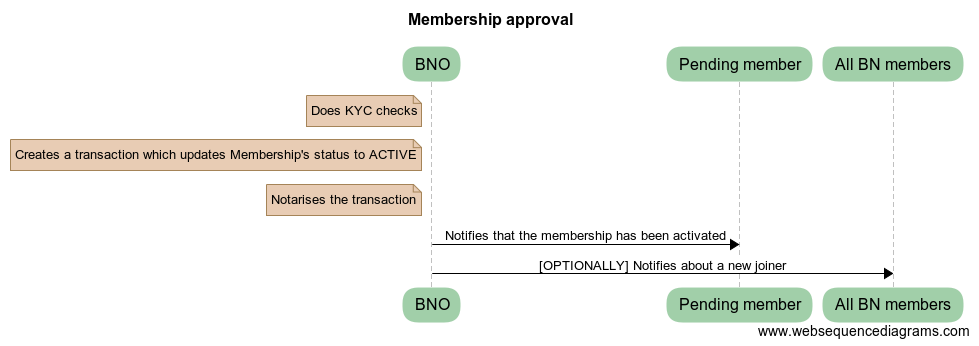
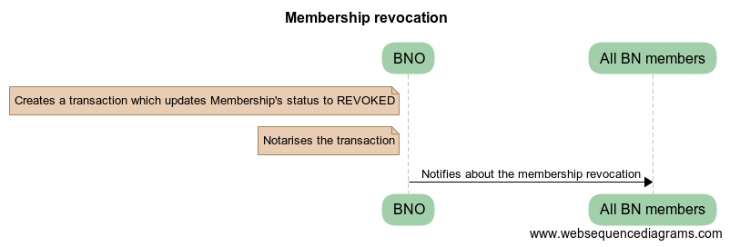
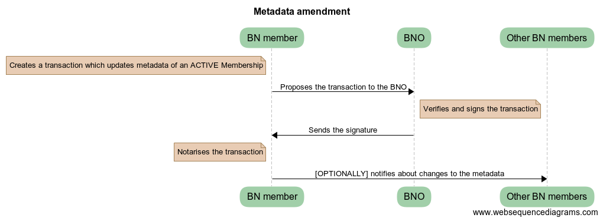
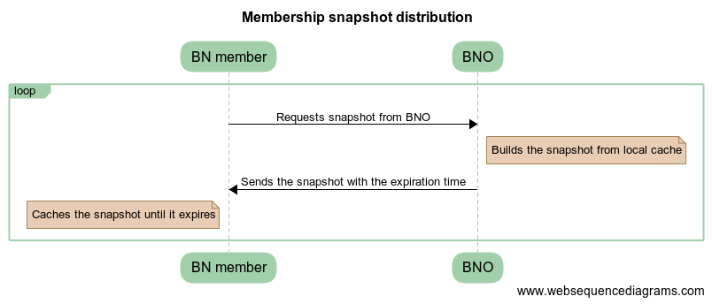

# Business Network Membership Service

DOCUMENT MANAGEMENT
---

## Document Control

| Title                | Business Network Membership Service                            |
| -------------------- | ------------------------------------------------------------ |
| Date                 | 04 May 2018                                                |
| Author               | Ivan Schasny, Dave Hudson, Mark Raynes                                           |
| Distribution         | Design Review Board, Product Management, Solutions Engineering, Platform Delivery |
| Corda target version | OS                                                   |

## HIGH LEVEL DESIGN

### Glossary

* *SE* - Solutions Engineer
* *BN* - Business Network
* *BNO* - Business Network Operator. A well-known party on the network.
* *BNMS* - Business Network Membership Service
* *CZ* - Compatibility Zone
* *Large Business Network* - a Business Network with >1000 nodes in it

### Overview

This proposal describes the architecture of a reference implementation for a Business Network Membership Service.

### Background

Corda v3 has introduced concepts of Compatibility Zones and Business Networks, which were very welcomed by the users. Numerous times, the SE team have received requests to provide reference implementations of CorDapps, which can be used to operate a BN, such as membership management, data recovery, reference data distribution, billing and others.

This design document is focused solely on a *business network membership management*.

Design choices are based on the following assumptions:
* Some BN's might see a lot of on-boardings per day, especially in the first days
* Membership revocation is a very rare event
* Membership metadata is changed infrequently. 5-10 times a day on a *large business network*
* BNs can have a large number of transactions
* During the first year no BN will get larger than 1000 nodes

### Scope

Design a reference implementation of an application, which can be used for BN membership management.

In-scope:
* On-boarding and revocation
* Distribution of membership data to BN members
* Membership checks, i.e. can I transact with this party for this purpose?

Non-goals:
* Scaling to a number of nodes beyond *large business network*
* Verifiable proofs of memberships
* KYC implementation
* Distribution of private network map at the Corda Application level.
* Automated CZ certificate provisioning. Can be implemented as a separate product if needed.
* Billing
* Private memberships list (masking data from other BN members)
* Contractual proofs of membership
* Distribution of the BNMS CorDapp

### Timeline

* Projects, which go live on Corda in 2018 are asking to have a reference implementation available *asap*.
* This will be an evolvable solution. We need to get more feedback about usage patterns which might result in future design changes.  

### Requirements

Requirements and use-cases have been gathered from various real-world projects, which the SE team members have been involved into.

* BNO should be able to on-board new participants to the BN in an automated manner.
* BNO should be able to revoke memberships.
* Integration with KYC solutions (*out of the scope*).
* Only verified BN members should be allowed to transact with each other.
* Membership service should be able to support *large Business Networks*.
* A participant of a BN should not be visible to any other BNs (unless they are also a member of that BN)
* BNO should be able to tweak membership service implementation for their needs.
* BNO should be able to sponsor new members to CZ in automated way.
* Nodes should be able to participate in multiple BNs.
* BNO can allow a delay in distribution to membership changes
* BN members should be able to associate a metadata with their identities and to distribute it to other participants.

### Assumptions

* It is assumed that BNO and BN members have been on-boarded using the standard JIRA-based Doorman identity mechanism
* It is assumed that the BNMS CorDapp will be distributed using the current manual means of distribution (eg. copying relevant jar file to nodes cordapps directory)
* BNO discovery is an "out-of-bounds" mechanism (eg. details of a BNO are explicitly provided to a participant node and must be configured as reachable in their node configuration)

### Target solution

As *Business Networks* is a fairly high-level concept, which might require some heavy customisations per business case, the proposed solution is to implement a BNMS at the Corda Application level, and to distribute it as CorDapp(s) to users. This approach would also ease an installation and integration of the BNO applications into the existing enterprise infrastructures, as it would require less integration points with not-flow based internal systems.

The design proposal is to issue *memberships* onto the ledger. The main reasons behind that are:
* The future support of *reference states*, would allow BN participants to *contractually* prove validity of their membership at the point when a transaction is made, by including their *membership states* as *reference inputs* into the transaction. *Lateness* of the reference inputs would be checked by Notary, while Smart Contract can assert that the transaction contains a membership-state-per-participant as *reference inputs*.
* BNO would have a way of immediately revoking a participant's membership, by unilaterally reissuing his *membership state* onto the ledger. Any subsequent attempt by the participant to use *not the latest* version of the membership state, would fail the *reference input* check. Revocations would have an immediate effect, comparing to other solutions, which would require some time for changes to get propagated.

The following *actors* have been identified:

* *BNO*. One BNO per BN.
* *BN member*. This is a registered member of BN. Can be many.
* *Non-member*. This is any *valid* participant of CZ, but not a member of the BN. Can be many.

*Membership state* virtually consists of 2 parts:

* _Membership Information_. Managed by the BNO. Contains such fields as *Issued Date*, *Modified Date*, *Status*, etc. Can be unilaterally changed by BNO.
* _Membership Metadata_. Managed by the state owner and the BNO. Supposed to contain *business-related* fields, such as *Node Type*, *Address*, *Phone Number*, etc. Can be changed only on request from the owning member. Each member is able to associate a custom *Metadata* with the *Membership State* he owns. Metadata gets distributed along with the *Membership States* as a part of general membership distribution mechanism (described in the further sections).

Memberships can exist in 3 statuses: *pending, activated* and *revoked*. As memberships live on the ledger, all state transitions are performed via *Corda transactions*. Only *status* or *metadata* of a membership can be amended after the membership has been issued onto the ledger. Each Corda transaction can evolve only *one* membership at a time.

Membership state intentionally doesn't contain any information about node's physical location. Resolution of Corda identities to *host:port* is done via CZ Network Map.

Each membership has two participants - member + BNO. BNO is able to unilaterally *approve* and *revoke* existing memberships, however to request a *new* membership or to *change* it's metadata, the member's participation is required. When BNO unilaterally updates membership state, the member would still see an update, but he wouldn't be a *signer*.

The design assumes that all participants have already been on-boarded onto CZ. To be able to contact the BNO, participants are required to have the membership service CorDapp installed on their nodes.

All interactions between nodes are performed using *Flows* framework.  

#### On-boarding

On-barding is split into 2 independent phases: *request* and *activation*.

##### Request

Each *non-member* can request BN membership from the *BNO* via a flow. Upon request, the BNO would issue a membership state onto the ledger in *pending* status.

*Pending* memberships may have to go through an explicit review and approval process (such as a formal KYC process in some financial scenarios), which are specific to each BN, before they get *activated*. BNMS can be integrated with KYC solutions on the back-end, such a CordaKYC, which is out-of-scope for this design.

##### Activation

After a *pending* membership has passed through the review and approval checks, BNO would unilaterally *activate* it and notify the *awaiting member* that now he can transact on the network.

Depending on the specific BN's requirements, the BNO can *optionally* notify *all other members* about the new-joiner (see *membership list distribution*).


Transaction structure

```
Inputs:
  No

Commands:
  Request
  signers: member, BNO

Outputs:
  New Membership state in PENDING status
  participants: member and BNO (optionally others)
```



Transaction structure

```
Inputs:
  Membership state in PENDING or REVOKED status
  participants: member and BNO (optionally others)

Commands:
  Activate
  signers: BNO

Outputs:
  Membership state in ACTIVE status
  participants: member and BNO (optionally others)
```

#### Revocation

The BNO can unilaterally revoke a membership, by setting its status to *revoked*.

When a membership gets revoked, the BNO can *optionally* notify all *BN members* to prevent them from transacting with the revoked member (see *membership list distribution*).



Transaction structure

```
Inputs:
  Membership state in ACTIVE status
  participants: member and BNO (optionally others)

Commands:
  Revoke
  signers: BNO

Outputs:
  Membership state in REVOKED status
  participants: member and BNO (optionally others)
```
#### Metadata updates

Update to metadata can be initiated by an *active member* only, with the BNO as one of the tx signers.

Depending on the specific BN's requirements, change proposer can *optionally* notify *all other members* about changes to the metadata (see *membership list distribution*).



Transaction structure

```
Inputs:
  Membership state in ACTIVE status
  participants: member and BNO (optionally others)

Commands:
  Revoke
  signers: member, BNO

Outputs:
  Membership state in ACTIVE status with updated metadata and the rest of the fields the same
  participants: member and BNO (optionally others)
```

#### Membership list snapshot

Membership snapshot - is a list of all active BN memberships + metadata associated with them. BNs are not envisaged to get significantly large in the near to medium term, to make snapshot distribution a bottleneck. To optimise snapshot distribution, CorDapp developers can:

* reduce amount of on-ledger metadata stored for each node
* increase expiration time-window
* cache snapshots in the BNO's CorDapp
* throttle snapshot requests

In the future *reference states* can be utilised for memberships distribution. Membership snapshot would effectively become a set of valid public keys and metadata distribution would be done on peer-2-peer basis. Valid metadata states would be added as reference inputs to transactions for contractual proof of membership. Exact design is out of scope for this document.

The future support of *Data Distribution Groups*, would allow to distribute membership snapshots more efficiently.

#### Membership list distribution

Depending on the specific BN's requirements, membership list can be distributed in the following ways:

* Snapshot-based approach. A snapshot consist of a list of active members + expiry time. Members should be caching the snapshot locally and re-request it upon expiration. A BN members will be pulling snapshots rather than the BNO pushing updates to them. As snapshot data is fairly static, it can be efficiently cached in the BNO's CorDapp. The BNO would be responsible for choosing right snapshot expiry time. For example, if expiry time is 24hrs, then for a *large Business Network*, the BNO would have to serve about 6 requests per minute only, given that the distribution is even.
This approach would work better for large networks with high frequency of joins / updates, as the BNO wouldn't have to broadcast notifications to all members on each change.
* In smaller BNs, members can be notified about each change. Instead of pulling snapshots periodically, the BN members would pull the snapshot just once upon start and then would start applying modifications to it in the real-time.

Each member is solely responsible for verifying his counterparts for eligibility to transact on the BN. Each flow would have to start with a statement, which asserts a validity of counterpart's membership by checking it against the cached snapshot. In the case, when a counterpart fails membership check, an explicit exception will be thrown. The how-to-do will be provided along with the reference implementation. The verification code could look like:

```
if (membershipSnapshot[counterparty].metadata.role != "AGENT") {
   throw FlowException("Only AGENT can invoke this flow")
}
```

Snapshot based approach assumes some delay in membership changes propagation. With the future support of *reference states*, using not latest membership would fail *reference input* checks. New-joiners might still encounter some delay before they get seen by other members on the network. The delay can be mitigated by enabling the BNO to notify other members about new-joiners, as described in the *Activation section*.

Nodes can expose membership list snapshot via RPC. Next refresh time can be distributed along with the snapshot for more dynamic applications. The how-to-do will be provided along with the reference implementation.



### API extension points

* KYC checks
* Membership change notifications
* Custom members metadata
